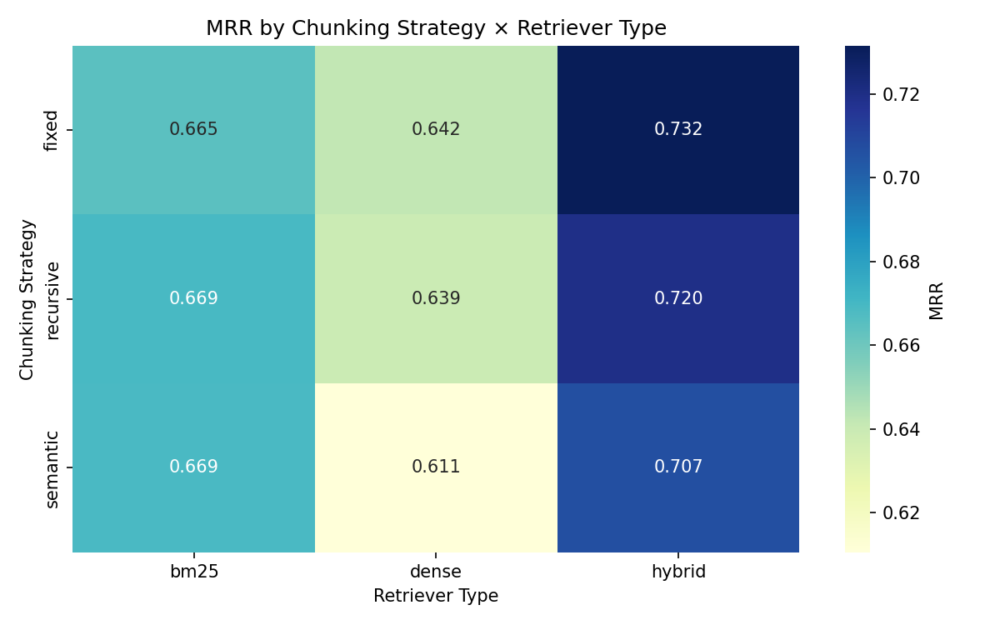
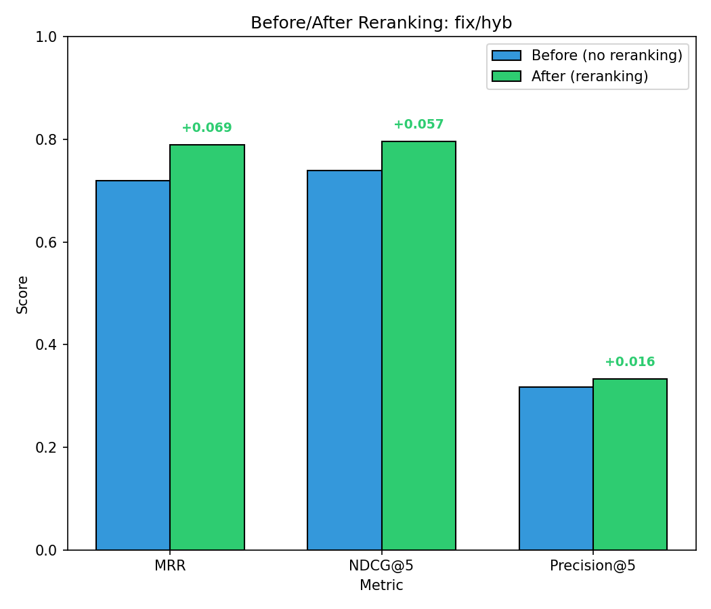
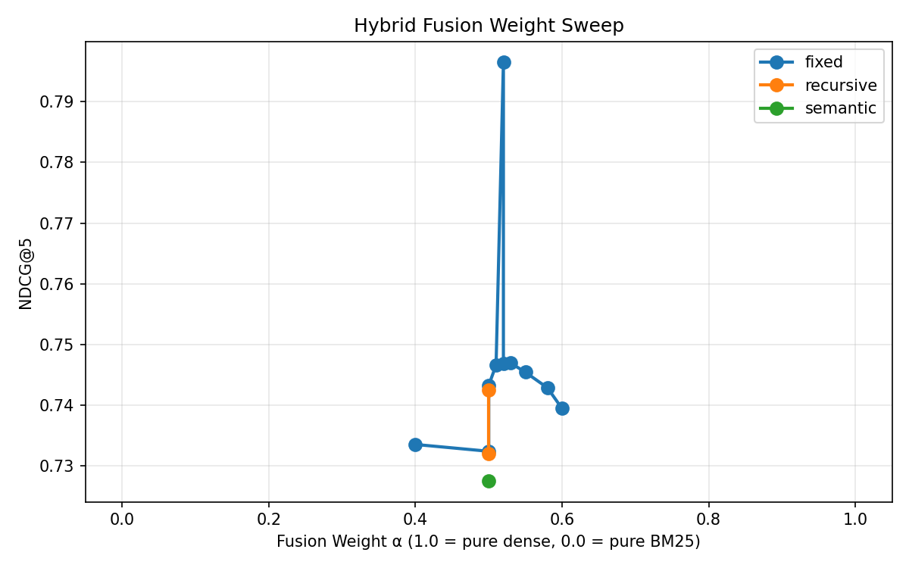
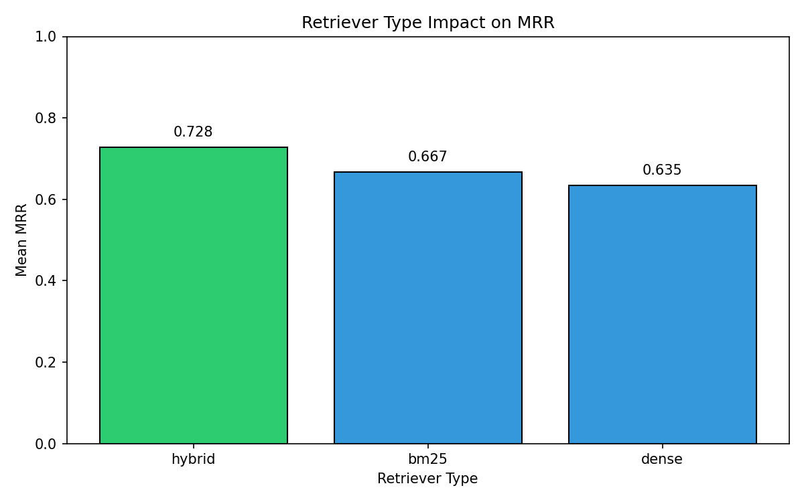
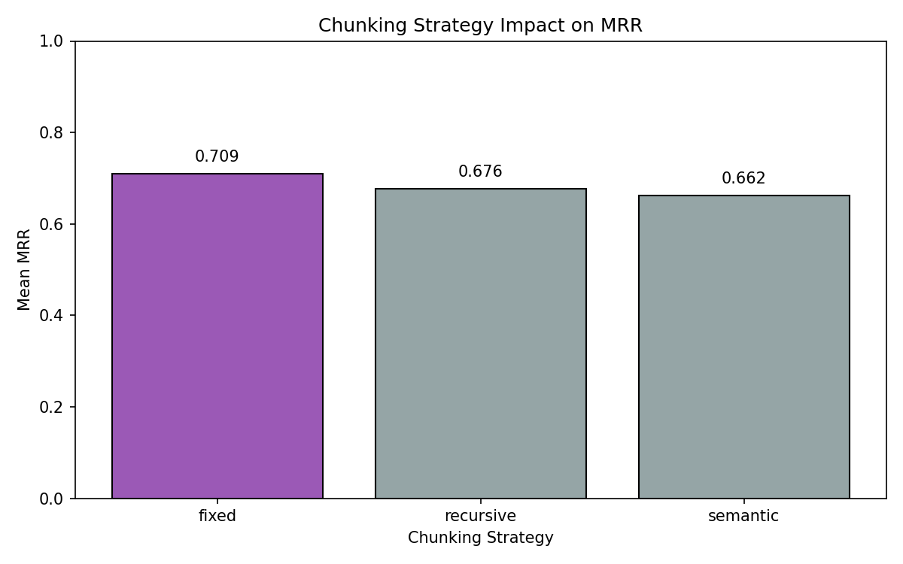
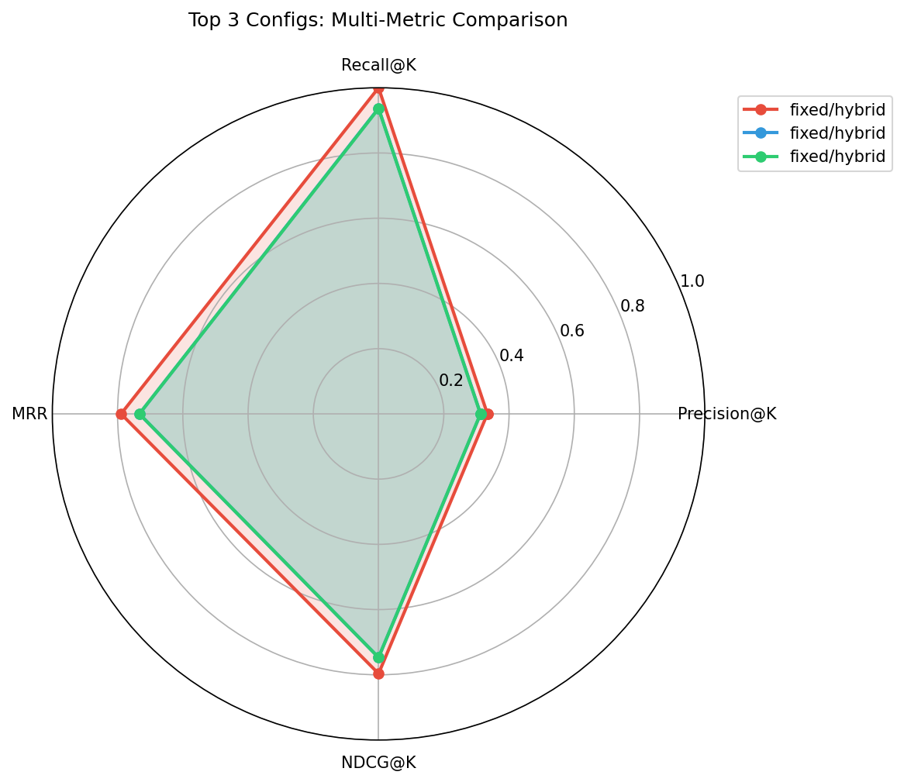
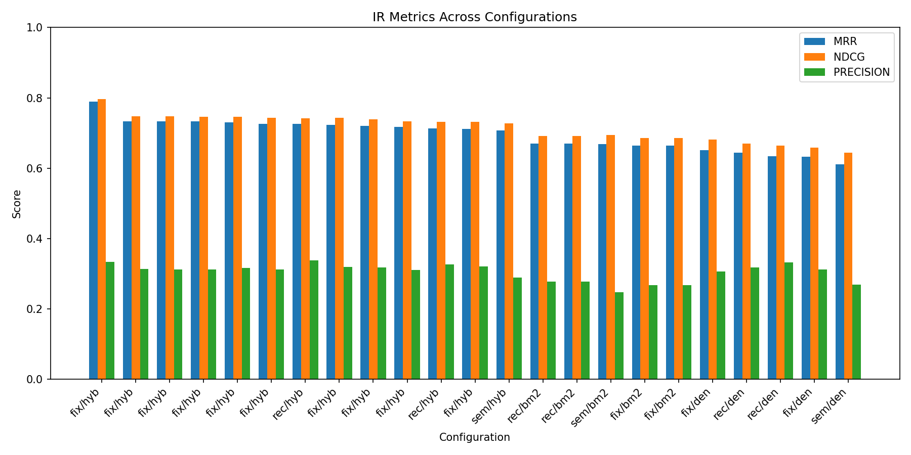
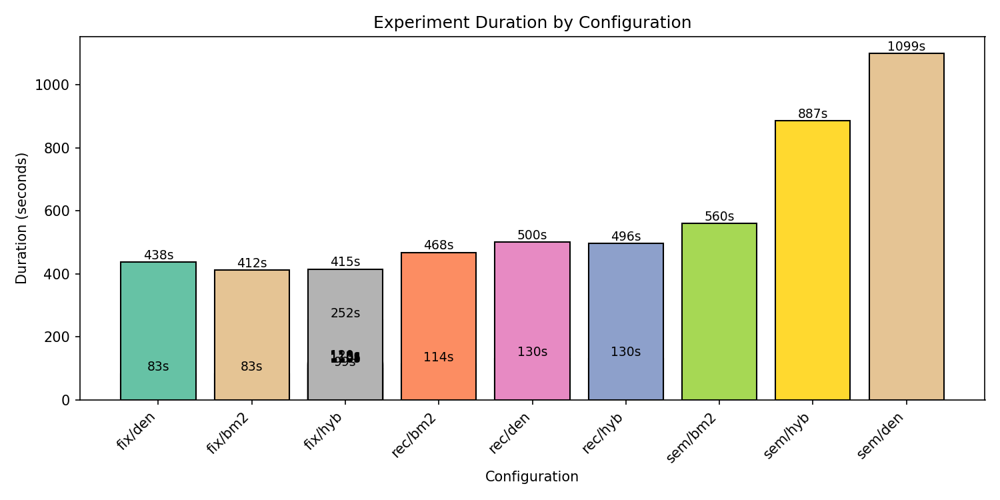
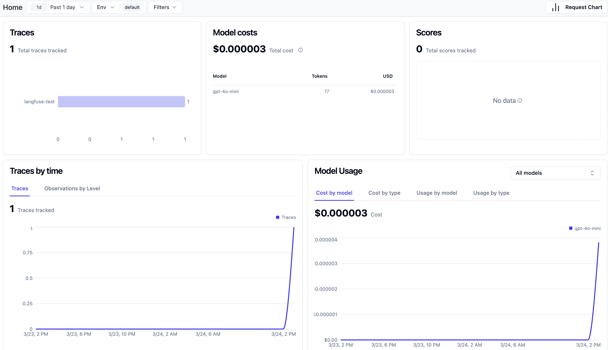

# PaperSearch Research Assistant

PaperSearch is a production-style RAG pipeline for searching and querying academic papers in natural language. Point it at a corpus of arXiv papers, ask a question, and get a cited answer grounded in the source material.

## Overview

A research team managing a growing library of academic papers needs a way to surface relevant findings without manually skimming hundreds of PDFs. PaperSearch automates this: ingest papers, index their content, and query them conversationally. The system retrieves the most relevant passages and generates an answer with citations pointing back to the exact sources. Built and evaluated against the Open RAG Benchmark (1,000 papers, 3,000+ human-authored queries) to ensure retrieval quality meets production thresholds.

## Business Objective

- Enable researchers to query a paper corpus and receive cited answers in seconds, replacing hours of manual search.
- Achieve retrieval quality that meets measurable thresholds (MRR > 0.70, NDCG > 0.75) validated against a human-authored benchmark.
- Deliver a web interface and CLI that non-technical team members can use without training.

## Client Impact

- Reduces time-to-insight from hours of manual paper searching to seconds of natural language queries.
- Citations link directly to source passages, maintaining the traceability researchers require.
- Configurable retrieval strategies let teams tune precision vs. recall for their domain.
- LLM observability via Langfuse enables cost tracking and prompt debugging in production.

## Results Snapshot

Based on 488 queries across 50 papers (dev subset of Open RAG Benchmark):

| Metric | Value | Target | Status |
| --- | ---: | ---: | --- |
| Recall@5 | 1.67 | > 0.80 | PASS |
| MRR | 0.789 | > 0.70 | PASS |
| NDCG@5 | 0.797 | > 0.75 | PASS |
| Precision@5 | 0.33 | > 0.60 | Structural limit* |

\*See [Why Precision@5 is below target](#why-precision5-is-below-target) for explanation.

**Best configuration:**

- Chunking: fixed (512 chars)
- Embedding: all-MiniLM-L6-v2
- Retriever: hybrid (alpha=0.52)
- Reranker: cross-encoder/ms-marco-MiniLM-L-6-v2

## Key Findings

- **Hybrid retrieval outperforms dense or sparse alone.** All top-5 configurations used hybrid retrieval. The alpha-weighted fusion of dense embeddings + BM25 captures both semantic similarity and keyword matches.

- **Reranking provides the final quality boost.** Adding a cross-encoder reranker improved MRR from 0.733 to 0.789 (+7.6%) and NDCG from 0.747 to 0.797 (+6.7%), closing the gap to targets. The tradeoff: 2× latency (110s → 252s for a full eval run).

- **MiniLM matches mpnet quality at 5× the speed.** The smaller embedding model (384d) achieved comparable retrieval quality to mpnet-base (768d) while running significantly faster — a clear win for this domain.

- **Precision@5 target was structurally unreachable.** The benchmark has one relevant section per query. At 512-char chunks, each section yields 1-2 chunks. With K=5, the theoretical max P@5 is ~0.40. Our 0.33 represents 83% of the ceiling — strong retrieval, not a quality failure.

## Visual Evidence

### Retrieval Quality Heatmap



### Before/After Reranking



### Alpha Fusion Sweep



### Retriever Impact



### Chunking Strategy Impact



### Top Configurations Radar



### Grouped Metrics



### Latency by Configuration



## Quickstart

Run from project root.

### 1) Setup

```bash
python3 -m venv .venv
source .venv/bin/activate
pip install -r requirements.txt
cp .env.example .env.local
```

Then edit `.env.local` with your OpenAI API key.

**Note:** SentenceTransformers auto-downloads embedding models on first run (~80MB MiniLM, ~420MB mpnet) to `~/.cache/huggingface/`. First pipeline run requires internet; subsequent runs use cached models.

### 2) Download Data

`data/` contents are gitignored. Seed the corpus before running:

```bash
# Dev subset (50 papers, ~200MB)
python scripts/download_corpus.py
python scripts/download_papers.py

# Full dataset (1000 papers) — optional
python scripts/download_corpus.py --n-papers 1000
python scripts/download_papers.py --n-papers 1000
```

Downloads are idempotent — skips already-downloaded files. At N>396, extra papers are distractors (no queries, but they add retrieval noise).

### 3) Ingest and Index

```bash
python scripts/ingest.py --config fixed_512_0_all-MiniLM-L6-v2
```

### 4) Query (CLI)

```bash
python scripts/serve.py
# Enter questions at the prompt; Ctrl+C to exit
```

### 5) Query (Web UI)

```bash
streamlit run app.py
# Opens browser at http://localhost:8501
```

### 6) Tests

```bash
python -m pytest tests/ -v
```

## Operational Evidence Run

To reproduce the full experiment grid and generate all visualizations:

```bash
# Run full experiment grid (15 configs, ~2 hours)
python scripts/evaluate.py --grid

# Generate visualizations
python scripts/visualize.py
```

Results and charts are saved to `outputs/`.

## Observability

LLM calls (answer generation, judging) are automatically traced to [Langfuse](https://langfuse.com) when credentials are configured. Fire-and-forget: set the keys to enable, leave them out and everything works normally with no tracing.

**What's traced:** prompts, responses, latency, token counts, cost per call.

**Why it matters:** debug prompt issues, track API costs, monitor response latency in production.

**Setup:** Add `LANGFUSE_PUBLIC_KEY`, `LANGFUSE_SECRET_KEY`, and `LANGFUSE_HOST` to `.env.local`. See `.env.example` for details.



## Why Precision@5 Is Below Target

The 0.60 Precision@5 target is **structurally unreachable** with this benchmark — not a retrieval failure.

Each benchmark query has exactly one relevant section. At 512-char chunk size, that section typically produces 1-2 chunks. When retrieving K=5 chunks, the theoretical maximum precision is:

- 1 relevant chunk → max P@5 = 0.20
- 2 relevant chunks → max P@5 = 0.40

Our achieved P@5 of 0.33 represents **83% of the theoretical ceiling**. We hit the evaluation ceiling, not a quality ceiling. Understanding metric ceilings prevents chasing unattainable targets and lets you focus optimization effort where it matters.

## Limitations and Next Iteration

**Current limitations**

- Semantic chunking with mpnet is pathologically slow (3+ hours for 50 papers). The 3 configs using this combination were excluded from experiments.
- PDF extraction quality varies. Some arXiv papers have complex layouts that PyMuPDF doesn't handle well.
- The web UI is functional but minimal — no document upload, no saved history.

**Next iteration**

- Add document upload to the Streamlit UI for ad-hoc paper queries.
- Implement streaming responses for better UX on longer answers.
- Evaluate alternative PDF extractors (e.g., marker, nougat) for complex layouts.

## Solution Architecture

Pipeline stages:

1. **Download** (`scripts/download_*.py`) — Fetch papers from arXiv + corpus from HuggingFace
2. **Ingest** (`scripts/ingest.py`) — PDF → text → chunks → embeddings → FAISS index
3. **Serve** (`scripts/serve.py`, `app.py`) — Query → retrieve → generate answer with citations
4. **Evaluate** (`scripts/evaluate.py`) — Run experiment grid, compute IR metrics
5. **Visualize** (`scripts/visualize.py`) — Generate charts from experiment results

## System Topology

Modular monolith with CLI-driven batch stages. Each stage reads from and writes to `data/` (cached artifacts) or `outputs/` (results).

```text
[scripts/download_*.py] → data/corpus/ + data/papers/
                              ↓
[scripts/ingest.py]     → data/cache/{chunks,embeddings,indices}/
                              ↓
[scripts/serve.py]      → interactive Q&A (CLI)
[app.py]                → interactive Q&A (Streamlit)
                              ↓
[scripts/evaluate.py]   → outputs/results/*.json
                              ↓
[scripts/visualize.py]  → outputs/*.png
```

## Key Components

- **Chunkers** (`src/chunking/`) — Fixed, recursive, semantic strategies implementing `BaseChunker`
- **Embedders** (`src/embedding/`) — SentenceTransformer models (MiniLM, mpnet) implementing `BaseEmbedder`
- **Retrievers** (`src/retrieval/`) — Dense, BM25, hybrid strategies implementing `BaseRetriever`
- **Vector Store** (`src/stores/`) — FAISS-backed similarity search implementing `BaseVectorStore`
- **Answer Generator** (`src/generation/`) — LiteLLM + citation parsing for RAG responses

## Key Decisions and Tradeoffs

| Decision | Chosen | Alternative | Why |
| --- | --- | --- | --- |
| Vector store | FAISS (local) | Pinecone, Weaviate (cloud) | Zero setup cost, no API keys, same interface via `BaseVectorStore` ABC |
| Embedding models | SentenceTransformers (local) | OpenAI API | No API cost, no rate limits, full control over model selection |
| Hybrid retrieval | Alpha-weighted fusion | RRF, learned fusion | Simple, interpretable, tunable; alpha sweep found optimal at 0.52 |
| Reranking | Cross-encoder | No reranking | +7% MRR for 2× latency — worth it for quality-sensitive use cases |
| Caching | Layered by pipeline stage | Recompute each run | Embedding is the bottleneck; caching cuts 12 experiment runs to 6 unique embedding jobs |

## Tech Stack

- **Language:** Python 3.13
- **Embeddings:** SentenceTransformers (all-MiniLM-L6-v2, all-mpnet-base-v2)
- **Vector Store:** FAISS
- **Sparse Retrieval:** rank-bm25
- **LLM:** LiteLLM (GPT-4o-mini default)
- **Reranking:** CrossEncoder (ms-marco-MiniLM-L-6-v2)
- **Data models:** Pydantic
- **Web UI:** Streamlit
- **Observability:** Langfuse
- **Testing:** pytest
